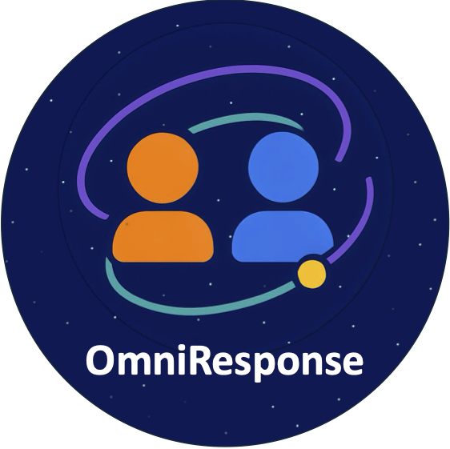

<div align="center">

  <!-- Main Title -->
  <!-- Title Claim Badge -->
  <p style="margin: 0.5rem 0;">
    
  </p>

  <!-- Subtitle -->
  <h2>
    OmniResponse: Online Multimodal Conversational Response Generation in Dyadic Interactions
  </h2>
  <br/>

  <!-- Authors -->
  <p>
    <a href="https://chengluo.cc/">Cheng Luo</a><sup>1</sup> &middot;
    <a href="https://jianghui-wang.github.io/">Jianghui Wang</a><sup>1</sup> &middot;
    <a href="#">Bing Li</a><sup>1</sup> &middot;
    <a href="#">Siyang Song</a><sup>2,3</sup> &middot;
    <a href="https://www.bernardghanem.com/">Bernard Ghanem</a><sup>1</sup>
  </p>
  <br/>

  <!-- Affiliations -->
  <p>
    <sup>1</sup> <a href="https://ivul.kaust.edu.sa/">IVUL Lab, KAUST</a> &middot;
    <sup>2</sup> University of Exeter &middot;
    <sup>3</sup> Awakening AI
  </p>
  <br/>

  <!-- Logo -->
  
  <br/><br/>

  <!-- Webpage & Badges -->
  <p>
    <a href="https://omniresponse.github.io/">
      
    </a>
    <a href="https://arxiv.org/abs/2505.21724">
      
    </a>
    <a href="https://huggingface.co/datasets/awakening-ai/ResponseNet" target="_blank" rel="noopener">
      
    </a>
  </p>

</div>

<!-- 📢 News -->
<section id="news">
  <h2>📢 News</h2>
  <ul>
    <li><strong>Sep 28, 2025</strong> — 🎉 Our paper <em>OmniResponse</em> has been <strong>accepted to NeurIPS 2025</strong>!</li>
  </ul>
</section>

<section id="todo">
  <h2>📝 TODO</h2>
  <ul>
    <li>✅ Release the OmniResponse paper</li>
    <li>✅ Release the dataset</li>
    <li>▢ Release the inference code</li>
    <li>▢ Release the rendering code and pretrained models</li>
    <li>▢ Provide model checkpoints for various LLM backbones</li>
    <li>▢ Release the training code</li>
  </ul>
</section>

<!-- 📋 Table of Contents -->
<section id="contents">
  <h2>📋 Table of Contents</h2>
  <!-- TODO: List major sections with anchor links -->
</section>

<!-- 🛠️ Installation -->
<section id="installation">
  <h2>🛠️ Installation</h2>
  <!-- TODO: Document prerequisites and environment setup -->
</section>

<!-- 👨‍🏫 Getting Started -->
<section id="getting-started">
  <h2>👨‍🏫 Getting Started</h2>
  <!-- TODO: Provide quickstart examples and basic usage -->
</section>

<!-- 🧰 Data Preparation -->
<section id="data-preparation">
  <h2>🧰 Data Preparation</h2>
  <!-- TODO: Explain dataset download, organization, and preprocessing -->
</section>

<!-- 🔧 External Tools -->
<section id="external-tools">
  <h2>🔧 External Tool Preparation</h2>
  <!-- TODO: List and link required external models or utilities -->
</section>

<!-- 🚀 Training -->
<section id="training">
  <h2>🚀 Training</h2>
  <!-- TODO: Show training commands, hyperparameters, and options -->
</section>

<!-- 🎯 Evaluation -->
<section id="evaluation">
  <h2>🎯 Evaluation</h2>
  <!-- TODO: Describe evaluation scripts and metrics -->
</section>

<!-- 🧪 Customized Inference -->
<section id="inference">
  <h2>🧪 Customized Inference</h2>
  <!-- TODO: Explain how to run real‐time or offline inference -->
</section>

<!-- 🖊️ Citation -->
<section id="citation">
  <h2>🖊️ Citation</h2>

If this work helps in your research, please cite the following papers:

```bibtex
@article{luo2025omniresponse,
  title   = {OmniResponse: Online Multimodal Conversational Response Generation in Dyadic Interactions},
  author  = {Luo, Cheng and Wang, Jianghui and Li, Bing and Song, Siyang and Ghanem, Bernard},
  journal = {arXiv preprint arXiv:2505.21724},
  year    = {2025}
}
